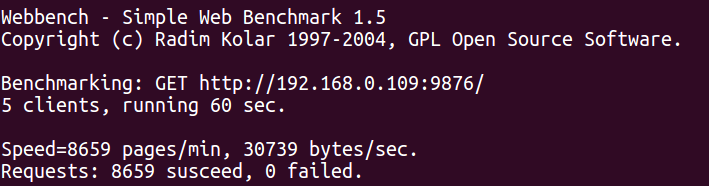

关于**webbench**的功能和原理，这里不做介绍，详情可见[webbench介绍](https://www.jianshu.com/p/dc1032b19c8d)。[webbench源码剖析](https://blog.csdn.net/jcjc918/article/details/44965951?depth_1-utm_source=distribute.pc_relevant.none-task&utm_source=distribute.pc_relevant.none-task) 。 
***
[下载与安装教程](https://blog.csdn.net/deep_kang/article/details/81204489)
***
webbench计算服务器性能的方式：每个子进程发送一个http请求，然后就关闭发送端的文件描述符，然后阻塞在`read`上。当读取完服务端发送的所有数据后，累加相应的字节数，然后成功请求数量加1，一次http请求和应答就此完成。结束测试时，父进程会累加所有子进程成功完成的http请求、收到的字节数和未完成的http请求。

- - - 
**webbench**运行结果
  
其中**Requsts**中**susceed**和**failed**表示在测试的这段时间**t**中，成功和失败的总请求数。**Speed**表示 **(susceed+failed/t*60)** ，即每分钟成功和失败的请求总数。后面的表示每秒传输的字节数。
