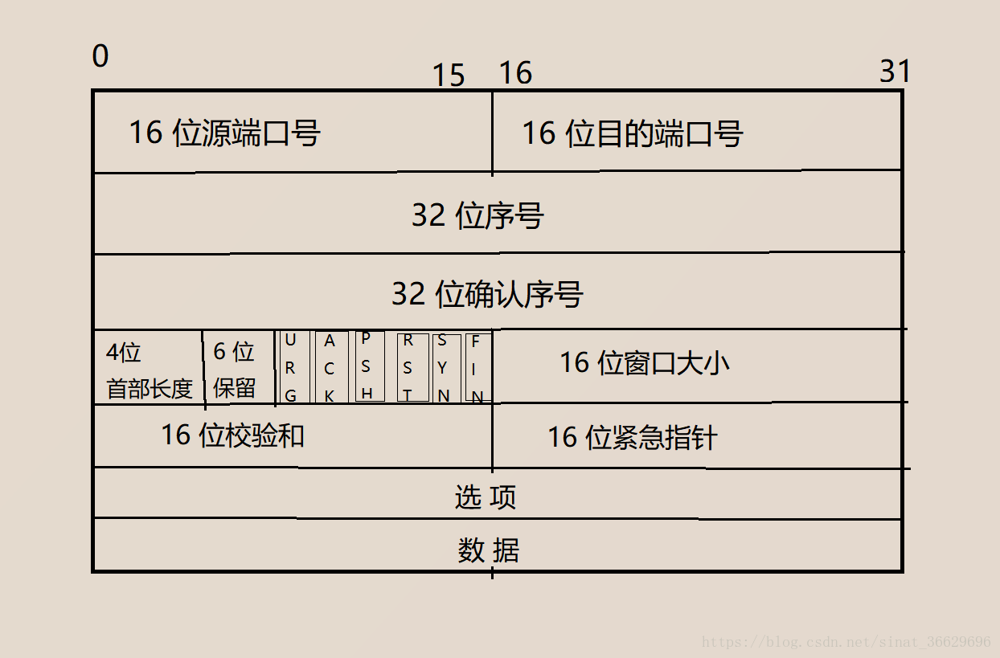

### 1. TCP首部介绍
> 
> * TCP规定，在建立连接后，**所有传送的报文都必须把ACK置为一**；所以准确的说，当TCP断开连接时，其中第一个断开连接请求也是**ACK=1**的。

### 2. TCP建立连接三次握手过程
> * 最初客户端和服务端都处于**CLOSE**（TCP状态转换的一种）状态。
> * 服务端进程先创建**TCB**，进入**LISTEN**状态，准备接收来自客户端的连接；
> **传输控制块TCB(Transmission Control Block)**，主要存储每一个TCP连接的重要信息，
> 例如TCP连接表；指向接受和发送缓冲区的指针；指向重传队列的指针；保存发送和接受的序号
> * 客户端进程也建立**TCB**，然后发送连接请求报文段。该报文段中同步位**SYN=1**，
> 并且随机产生初始序号**seq=x**。虽然该报文段**不能携带数据**,但是需要**消耗掉一个序号**，
> 此时客户进程进入**SYN-SENT**状态。
> * 服务端进程接收到客户端建立连接请求后，如果同意建立请求，则发送确认报文段。在该报文段中同> 步位**SYN=1**、确认位**ACK=1**，同时确认序号**ack=x+1**，表明下一次接收报文的序列号为
> **x+1**；同时表明自己本次序列号为**seq=y**。该报文段也**不能携带数据**，但是**消耗一个
> 序列号**。此时服务端进程进入**SYN_RCVD**状态。
> * 客户端进程接收服务端的确认报文后，还需要再再向服务端发送一个确认报文。该报文中，
> 确认位**ACK=1**，确认序列号**ack=y+1**，自己的序列号**seq=x+1**。该报文段可以携带
> 数据。如果未携带数据则不消耗序列号，即下次发送数据的序列号依然是从**seq=x+1**开始。
> 此时客户端进程进入**ESTABLISHED**状态。
> * 当服务端接收到客户端的确认报文后，服务端也进入**ESTABLISHED**状态。
> * 自此TCP连接建立完毕。

### 3. TCP建立连接的过程为什么不能是两次？
> * 总的来说是为了防止服务器白白等待浪费资源。
> * 如果采用两次握手，想像如下的场景：客户端希望和服务端建立连接，在客户端第一次发送请求连接报文后（**SYN=1**
> 的报文），由于网络拥塞，该报文暂时未到达服务端；客户端在规定时间范围内未收到服务端发来的确
> 认报文，超时重传机制使客户端发送了第二个请求连接报文，该报文顺利到达，并且与服务端建立
> 连接，互传数据，关闭连接。如果此时第一次发送的被阻塞的请求连接报文所处网络通畅了，被顺利
> 发送至服务端，服务端以为这是客户端重新发起的请求连接，并不知道这其实是一个已经失效的报文
> 段。此时服务端同意建立新的连接，并且返回该连接的确认报文。当
> 客户端收到该确认报文时，因为客户端并没有发起建立连接的请求，所以客户端不会理睬，也不会
> 向服务端发送任何数据。这就导致服务端认为建立了一个新的连接，而一直等待客户端发送数据，
> 白白浪费资源。如果采用三次握手，客户端对于服务端发来的确认请求不予理睬，服务端收不到
> 客户端的确认，即不会建立新的连接，避免了服务端的资源浪费。

### 4. TCP建立连接为什么不能是四次？
> * 三次握手已经满足需要，可以正确建立连接，使用四次就显得多余了

### 5. TCP断开连接四次挥手过程
> * 一般情况下，由客户端主动断开连接，服务端被动断开连接，此时两者都处于**ESTABLISHED**
> 状态。
> * 当发送完所有数据时，就发送连接释放报文请求断开连接。该报文中终止位**FIN=1**，序列号
> **seq=u**（等于前面已经发送的最后一个字节数据序列号加1）。客户端进入**FIN-WAIT-1**
> 状态。该报文段不能携带数据，但是消耗一个序列号。
> * 服务端接收客户端的释放连接报文，返回一个确认报文。该报文中确认位**ACK=1**，确认序列号
> **ack=u+1**，同时设置自己的序列号**seq=v**（等于前面已经发送数据最后一个字节编号加一）。
> 此时服务端进程进入**CLOSE-WAIT**状态。服务端通知高层的应用进程，客户端至服务端的连接
> 已经释放，此时的状态被称为**半关闭状态**，即客户端已经没有要发送的数据了，但是服务端
> 依然可以发送数据，并且客户端可以接受。
> * 当客户端收到服务端的确认报文后，进入**FIN-WAIT-2**状态。在此期间，客户端还接受
> 服务端发来的数据。
> * 当服务端将最后的数据发送完毕后，服务端发送连接释放报文。该报文终止位**FIN=1**，假设
> 自己的序列号**seq=w**（在半关闭状态，服务端可能又发送了一些数据，所以序列号会改变，不
> 再是**seq=v**）。确认序列号依然是**ack=u+1**。服务端进入**LAST-ACK**状态。
> * 客户端接收到服务端的连接释放报文，返回确认报文。该报文确认位**ACK=1**，确认号
> **ack=w+1**；自己的序列号**seq=u+1**。此时客户端进入**TIME-WAIT**状态，此时TCP连接还
> 没有完全释放，必须等待**2\*MSL(Maximum Segment Lifetiem，最长报文段寿命)**时间后，
> 客户端撤销相应的**TCB**后，连接才完全释放，客户端进入**CLOSED**状态。
> * 服务端接收到客户端的确认报文后，服务端撤销**TCB**， 结束本次TCP连接，
> 进入**CLOSED**状态。

### 6. **TIME-WAIT**的意义？（或者为什么主动释放连接的一方需要等待2\*MSL时间）
> * **为了可靠的实现TCP全双工连接的终止**。如果没有**TIME-WAIT**机制，客户端在发送完
> 确认报文后立马进入**CLOSED**状态，碰巧这个确认报文丢失了；服务端的重传机制会重新发送
> 连接释放请求，而此时客户端并没有与之对应连接，所以客户端会响应一个**RST**，让服务端按非
> 正常流程终止TCP连接。所以**TIME-WAIT**机制是为了可能重传那个丢失的ACK。
> * **为了允许老的重复的分节在网络中消逝**。假设没有**TIME-WAIT**状态，在TCP连接正常断开
> 后，可能在客户端和服务端之间立刻创建相同的TCP连接（对于客户端和服务端，IP地址和端口号与刚
> 刚断开的连接完全一样），那么由于网络阻塞滞留在网络中的分节就可能会被重新发送到客户端或者
> 服务端，而这个分节本应该是一个失效的分节。如果等待**2\*MSL**后，这段时间足以让某一个
> 方向上的分节存活MSL后被丢弃，另一个方向上的分节分节最多存货MSL也被丢弃。这样就能保证
> 每次新建TCP连接时，来自旧连接重复的分节在网络中消失。

### 7. **TIME-WAIT**的时间为什么是2\*MSL，能不能是小于2\*MSL的值？
> 等待第一个MSL是为了让自己发送的ACK要么被接收，要被消失在网络中；等待的第二个MSL是为了
> 防止在对端接收ACK之前的那一瞬间，对端可能重传FIN报文从网络中消失。虽说TIME-WAIT状态有
> 两个目的，但是这段时间具体为多长，主要为了达成第二个目的而设计的。

### 8. TCP保活机制
> 假如有这样的场景，客户端和服务端已经建立了TCP连接，可是客户端**主机突然奔溃了**（是主机，而不是进程），如果没有相应的措施，那么服务器进程可能一直等待客户端发送数据，造成服务端资源浪费。TCP使用保活计时器来处理这种情况。每次服务端收到客户端的报文后，服务端会重新设置保活计时器，通常设置为两小时；如果两小时之内服务端都没有收到来自客户端的消息，服务器就发送一个探测报文段，以后每隔75分钟发送一次；连续发送10次后客户仍然没有回应，则服务端认为客户端发生故障，主动关闭连接。

### 9. 建立TCP连接后，异常情况分析
> * 建立TCP连接后，如果通信双发有一方的**进程突然奔溃了**：
>   > 当本地端的进程突然崩溃了，作为进程终止处理的一部分，所有打开的文件描述符都会被关闭，这样导致向对端发送一个FIN请求释放连接的报文，对端回应一个ACK确认报文。由于对端不知道本地端的进程已经结束，可能会向本地端发送数据，而此时本地端的进程已经终止，没法读取数据，所以本端会回应一个RST复位报文（如果对已经接受了RST的套接字继续执行写操作，则会产生**SIGPIPE**信号；该信号的默认行为是终止进程。如果一个进程中有多个套接字，该信号的递交无法告诉我们是哪个套接字发生了错误。如果我们需要知道是哪个套接字发生了错误，可以选择忽视该信号，然后相应的`write`函数会返回**EPIPE**）。  
> * 建立TCP连接后，如果通信双方有一方**主机奔溃了**；
>   > 当本地端主机突然奔溃了，如果对端等待在读数据上，那么对端可能会永远等待下去（**TCP保活机制**可以处理这种情况）。如果对端要向本地端写数据，由于本地端主机已经崩溃，等于网络上已经没有相应的主机存在，所以对端在几次超时重传后，会返回**ETIMEOUT**错误，或者中间某个路由器判定主机不可达，返回**destination unreachable**ICMP消息，那么返回的错误是**EHOSTUNREACH**或者**ENETUNREACH**。
> * 建立TCP连接后，如果通信双方有一方**主机奔溃，但是立马由重启了**；
>   > 当本地端主机突然崩溃由立马重启了，如果对端等待在读数据上，则对端丝毫没有察觉，可能会永远等下去；如果对端准备向本地端主机发送数据，由于本地端重启丢失了所有的连接信息，所以本地端会回复一个**RST**复位报文。如果对端阻塞在`read`上，那么将返回**ECONNRESET**错误。
> * 建立TCP后，通信双方有一方**主机被手动关闭了**；
>   > Unix系统关机时，由**init**进程通常给所有进程发送**SIGTERM**信号（**可以被捕获**），该信号默认动作是终止进程。**init**进程等待一段固定时间后（一般5-20秒），然后给仍在运行的进程发送**SIGKILL**信号（**不可被捕获**），强制关闭所有进程；等待的这段时间主要是为了让捕获**SIGTERM**信号的进程完成相应的清理工作。当相应的进程终止时，所有的文件描述符被关闭，随后的步骤和选项**a**所示情况相同。

### 10. 为什么TCP建立连接是三次握手，而断开连接时四次握手?
> 建立连接时，服务端处理**LISTEN**状态下，收到建立连接SYN报文后，服务端此时没有其它需要处理的事情，所以将ACK和SYN放在同一个报文给客户端；当关闭连接时，服务端收到释放连接FIN报文后，此时只是表示客户端的数据发送完了，而服务端可能还未处理完的数据需要发送给客户端，所以需要将所有数据发送给客户端以后，才能发送给FIN释放连接报文；由于服务端将ACK和FIN分开发送，从而导致多了一次。

### 11. TCP确认应答机制(ACK机制)
> TCP将每一个发送的数据（不包括首部）都进行了编号，即序列号。每一个ACK中都包含一个确认序列号，意思是告诉对端下一次接收的序列号应该从哪开始，之前所有数据都已经接收。

### 12. TCP超时重传机制
> * 主机在发送的数据后，都会期望对端返回一个确认报文，以表示对方已经接收到了数据。如果主机在规定时间内没有收到确认报文，就会认为之前发送的数据丢失，重新发送。  
> * 超时重传时间（RTO，Retransmission TimeOut）如何确定？  
>   * 理想情况下应该选取一个最小的RTO，保证在这段时间内确认一定可以返回。但是网络环境复杂，该时间没法确定一个具体的值，一般是根据RTT时间，利用动态算法计算出来的。  
>   * 如果RTO设置的太长，发送端需要等待很长时间才能重传，影响整体的重传效率；如果RTO设置的太短，可能会造成不必要的重传。  
>   * 在Linux系统中，最小重传时间是0.2s，最大重传时间120s，最多重传15次。每次重传时间是上一次的2倍。

### 13. TCP滑动窗口
> * 如果TCP的确认应答机制要求发送端发送完每一个数据都需要等收到确认报文才能继续发送数据，这样有个明显的缺点就是传输性能较差，TCP中使用滑动窗口来加快传输速率；
> * 发送端会维持一个以字节为单位滑动窗口，该窗口表示无需等待确认应答，还可以继续发送窗口内的所有数据。该窗口后沿所有数据表示数据已发送，并且已收到确认应答；窗口前沿表示数据还未发送，并且暂时不能发送。当发送端收到确认应答时，会更新前沿和后沿向前移动。

### 14. TCP流量控制
> * 由于接收端处理数据的速度有限，所以当发送端数据发送过快，则会导致接收端的接收缓冲区被填满，使后续到达的数据被丢弃。所以流量控制就是为了控制发送端的发送速率，使接收端来的及接收。
> * 在通信双方的确认应答的报文中，会设置TCP首部中的窗口字段，用来告诉对端己方最多还可以接收多少字节的数据。该值会随着接收端接收数据而变小，随着接受端应用程序从接收缓冲区读取数据而变大。发送端可能会收到零窗口的确认报文。窗口字段为两个字节，可以表示0 - 65535。
> * 如果发送端接收到零窗口确认报文，会开启一个**持续计时器**，若持续计时器设置的时间到达，则发送端会发送携带一字节数据的**零窗口探测报文**，对方会在返回的确认应答中，给出现在的窗口值；如果对方窗口仍然是零，那么发送端就重新设置**持续计时器**。如果不是零，发送端就可以继续发送数据。

### 15. TCP拥塞控制
> * 什么是拥塞？
>   > 在某段时间内，若对网络某一资源的需求超过了该资源所能提供的可用部分，就会导致网络性能变差，这种情况就是拥塞。资源包括链路容量、交换节点中的缓存和处理机等。
> * 拥塞问题往往是由许多因素引起的，不是单独处理好其中某一个问题就可以解决的，其本质是因为系统各部分不匹配。比如某个网络节点的接受缓冲区比较小，到达该节点的的分组由于缓冲区满而被丢弃，所以发送端会重发。如果假设现在无限大提高该节点缓冲区大小，所有分组都可以在缓冲区排队，但是由于处理机和链路容量有限，所有分组的排队等待时间大大增加，所以发送端依然会因为超时重传这些分组。所以简单的提高某个资源的能力并不能很好的解决拥塞问题。
> * 拥塞控制
>   > 拥塞控制主要是为了防止过多的数据注入网络后，使网络中路由器和链路过载而导致网络性能变差。拥塞控制是一个全局性的过程，涉及所有主机、路由器以及所有影响网络传输速率的因素。而**流量控制**是一个端到端的问题，主要是控制好发送端的发送速率，以便接收端来得及接受。他们的共同点是都要求发送端降低发送速率，只不过拥塞控制是防止网络出现问题，而流量控制是防止接收端出现问题。
> * 拥塞控制算法
>   * 在每一个发送端，都会维持一个拥塞窗口。拥塞窗口的大小取决于网络的拥塞程度，并且动态变化。发送端的发送窗口是由拥塞窗口和对方确认应答中设置的窗口选项共同决定的。
>   * 慢开始
>       * 慢开始的思想是这样的，由于刚开始发送数据不知道网络的拥塞状况，所以贸然将大量数据发送到网络可能会导致拥塞，所以先发送少量数据，然后一步步扩大发送的数据量。
>       * 拥塞窗口的单位是报文段的个数，在刚开始发送数据时，将拥塞窗口大小设置为一，其数据量为一个MSS大小。每经过一个轮次的发送，就将拥塞窗口加倍。像这样的拥塞窗口增长速度是指数级的。为了防止拥塞窗口增长的过大，引入一个阈值。当拥塞窗口小于这个指时，使用慢开始算法。当大于这个值时，使用拥塞避免算法。每次当网络发生拥塞时（即未能按时接受确认报文，即认为网络发生了拥塞），将阈值设置为当前拥塞窗口的一般，并且将拥塞窗口设置为1，从新启动慢开始算法。
>   * 拥塞避免算法
>       * 拥塞避免算法的思想是为了让拥塞窗口缓慢增长，每经过一个轮次的发送，将拥塞窗口加——，这样拥塞窗口的增长速度是线性级别的。拥塞避免算法只是为了控制拥塞窗口增长的速度，这样可以降低网络出现拥塞的概率，而并不是真的可以避免拥塞。
>   * 快重传和快恢复
>       * 快重传要求当接收方收到一个乱序报文，立即发送重复确认（即再次发送确认应答，确认序列号与上一次一样），以此来告诉发送方有报文段未到达接收端。快重传规定当发送方连续接收到三次重复确认报文，就立马重传对方尚未发送的报文，而不需要等待超时重传的计时器到期。这样可以尽早发送未确认的报文。
>       * 快恢复是为了配合快重传算法。按道理，当发送端重传报文时，会要求拥塞阈值减半，并且拥塞窗口变为一，但是发送端认为此时网络拥塞的情况可能不是那么严重，否则不会收到连续的确认报文，所以此时没有必要将拥塞窗口变为一，并执行慢开始算法。快恢复规定将拥塞阈值设置为此时拥塞窗口的一半，并且将拥塞窗口设置为和拥塞阈值一样的值，然后执行拥塞避免算法，使拥塞窗口线性变大。

### 16. TCP延时应答和捎带应答
> * 延时应答
>   > 当接收端接收数据时，如果立即发送确认应答，此时应用程序可能还没来得及将数据取走，所以确认应答中的窗口设置可能比较小；如果只需要等待很少的时间，应用程序就可以取走数据，那么将增大确认应答的窗口，从而增大传输效率。所以接收端可以等待一端时间，再返回确认应答，这就是延时应答。一般等待时间不超过200ms，并且一般最多可以隔两个包必须返回应答。
> * 捎带应答
>   > 一般客户端和服务端都是一问一答式传输数据，所以服务端可以将确认应答嵌入在下一次发送数据的时候，将确认应答和数据一起发送给客户端。

### 17. Nagle算法
> * [参考连接](https://blog.csdn.net/wdscq1234/article/details/52432095)
> * 小包问题
>   > 当发送方每次只需要发送一个字节数据时，为了发送这一个字节，还需要至少再额外增加40字节的头部信息（TCP头部固定大小20字节和IP头部20字节），这样网络的利用率是很低的，而且大量的这种小包会增加网络拥塞的风险。
> * 为了处理小包问题，Nagle算法规定，TCP连接上**最多只能存在一个未被确认的小分组**，在该分组到达之前，不能再发送其它的小分节。整体算法流程如下：
>   > 
>   > ```
>   > if there is new data to send
>   >   if the window size >= MSS and available data is >= MSS
>   >       send complete MSS segment now
>   >   else
>   >       if there is unconfirmed data still in the pipe
>   >           enqueue data in the buffer until an acknowledge is received
>   >       else
>   >           send data immediately
>   >       end if
>   >   end if
>   > end if
> *  默认情况下，TCP自动开启**Nagle**算法，但不是所有场合下都适合**Nagle**算法。例如在广域网上进行远程连接，远程控制一台电脑时，远端应该实时接收本地端的输入的字符，并且实时回显。如果此时使用**Nagle**算法会有明显的延迟。可以通过设置`TCP_NODELAY`选项来禁用**Nagle**算法。
> * 当**Nagle**算法与延时应答之间的矛盾
>   > 当发送端发送了小数据包给接收端时，由于使用了**Nagle**算法，所以它会等待接收端的确认应答；而接收端使用延时应答机制，就先不返回应答。这就造成了短暂的死锁，解锁的时间就是接收端延时应答定时器到期了。这样的机制造成了不必要的延时。所以用户程序应该尽量避免`write-write-read`的调用。

### 18. TCP粘包
> * 什么是粘包现象？
>   > 简单来说是指发送端发送了若干包到接收端时粘成一包，即接收端无法区分每一个数据包的首位。
> * 为什么会出现粘包现象？
>   > * 发送端开启**Nagle**算法，导致小的内容拼接成大的内容一起发送到接收端；
>   > * 接收端应用层未能及时读取数据，多个数据包缓存在接收缓冲区，从而导致接收端无法区分每个包的边沿。
> * 如何处理粘包现象？
>   > * 将数据报的大小固定，不够的数据报用特殊字符填充，这样接收端每次读取固定大小数据就可以了。
>   > * 在每个数据报结尾加入固定的分割字符，接收端每次读到该特殊字符即表示读完一个数据包。
>   > * 在每个数据包前面添加固定几个字节数据表示该数据报的长度。

### 19. UDP协议
> * UDP协议只在IP数据报服务上添加了很少的功能，分用、复用和差错检查功能。
> * UDP协议主要特点：
>   > * UDP是**无连接的**，发送之前不需要建立连接，从而减少了开销和时延；
>   > * UDP只是**尽最大努力交付**，但**不保证可靠交付**；
>   > * UDP是**面向报文的**。发送方UDP对于应用程序交下来的报文，在添加自己的首部后，直接交付IP层。UDP既不会拆分报文，也不会合并报文，保留了报文的原始边界。
>   > * UDP**没有拥塞控制**，网络发生拥塞并不会降低发送端的发送速率，这对于很多实时的应用很重要。
>   > * UDP支持一对一、一对多、多对一的交互方式。
>   > * UDP首部开销小，只有8个字节。
> * UDP首部总有8个字节，总共四个字段，每个字段两个字节：
>   > * **源端口号**：在需要对方回信时使用，不需要时可以全用0；
>   > * **目的端口号**
>   > * **UDP数据报长度**：包括首部，最小值为8；
>   > * **校验和**：如果有错就丢弃该报文。
> * 当传输层从IP层接收到UDP数据报时，就根据相应的端口号，把首部去掉以后，将数据递交给给应用程序。如果接收方发现目的端口不存在，那么丢弃该报文，并由**ICMP**协议发送“端口不可达”差错报文给发送方。
> * 伪首部：
>   > * UD数据报计算检验和的方式比较特殊。在计算检验和时，要在UDP数据报首部添加12个字节的**伪首部**。之所以称为**伪首部**是因为这个不是真正的首部，只是在计算检验和时临时添加的，即不向上传送，也不想向下递交。

### 20. 为什么UDP和TCP可以分别拥有相同的端口号而互不干扰？
> * 在接收端，IP层向上交付数据时根据自己首部的协议字段进行分用，分别交给上层的TCP或者UDP，然后TCP和UDP再根据相应的端口号交付给应用进程。所以，即使TCP和UDP使用相同的端口号，但是他们在IP层到传输层的过程中，传递的路线已经不一样了，所以即使拥有相同的端口号也不会相互干扰。

### 21. TCP的SYN攻击（DDOS攻击）
> * **SYN**攻击指的是攻击客户端伪造大量假的IP地址，并且不断向服务器发送请求连接报文，服务器确认应答并等待客户端的确认。由于源地址根本不存在，服务器需要一直重传一直到超过额定的次数。这些伪造的SYN报文长时间占据未完成连接队列，使正常的SYN请求不能得到响应，使服务器丧失其本来的功能。